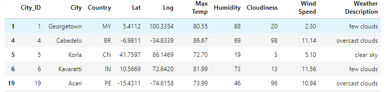
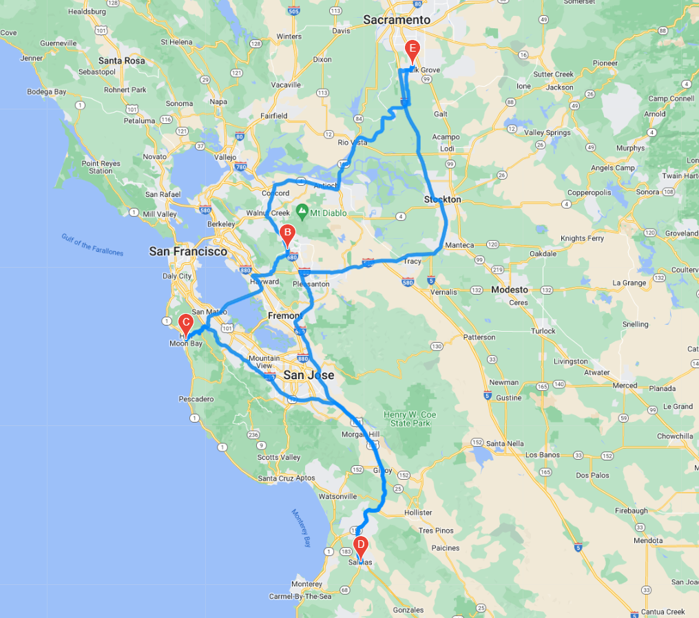
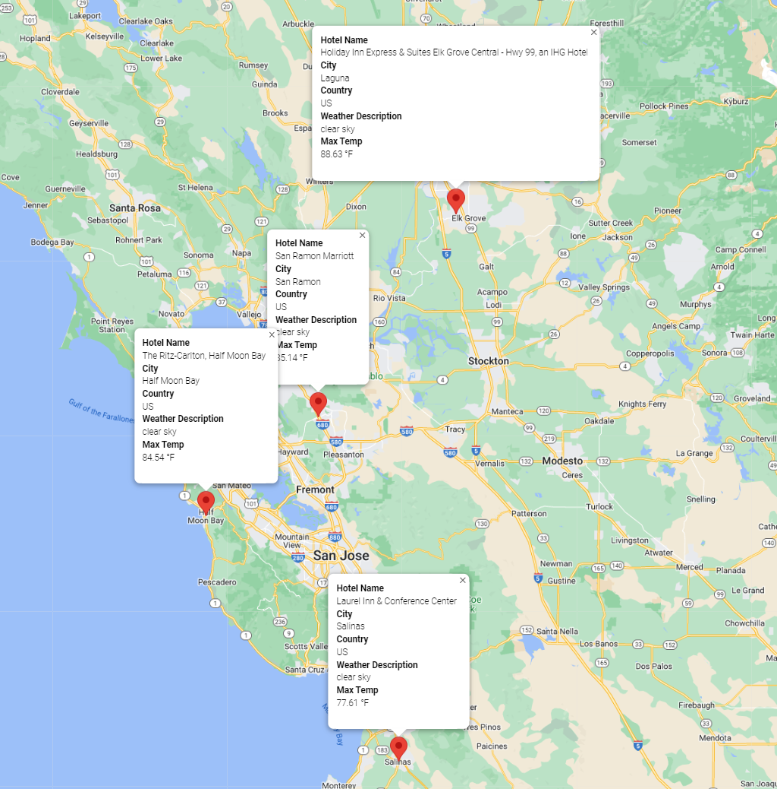

# World Weather Analysis

## Overview

The purpose of this analysis is to update the "PlanMyTrip" app. This update will include a weather description and the ability to map out potential travel destinations. 

### Weather Description

A weather description has been added to the Dataframe

### Travel Itinerary

Four cities have been chosen to map out a possible travel itinerary. E being the start and end location. 

Markers have also been added for the 4 locations giving information created through the Dataframe. 

## Summary

The "PlanMyTrip" app has been updated with these new features: weather description, travel destinations map, and markers for each destination. 